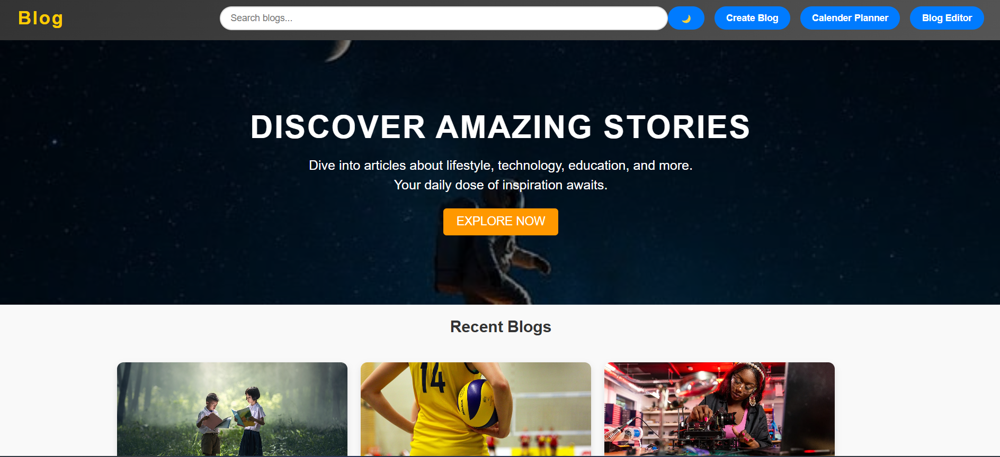
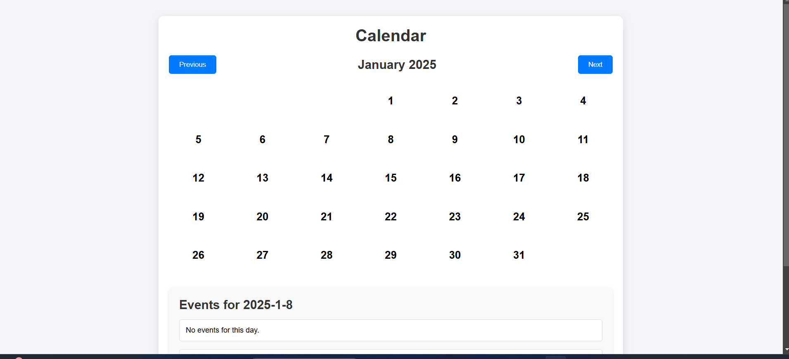
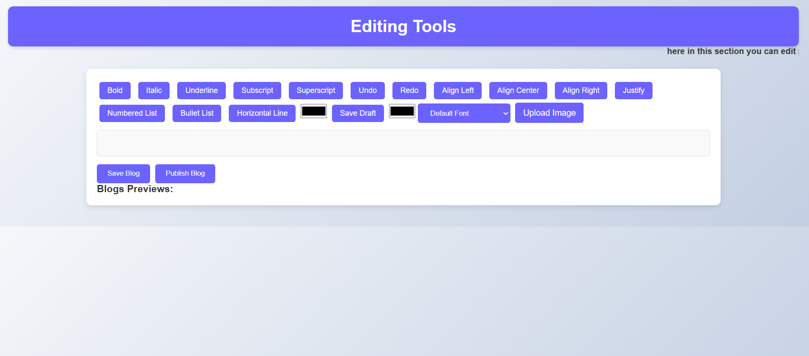

# hackathon-blog
blog website
This project is a simple and interactive blog website featuring a responsive design and multiple functionalities such as a dark mode/light mode toggle, a calendar planner, and a blog editor. The project comprises three main HTML, CSS, and JavaScript files, each dedicated to a specific functionality.
## features
Features

Dark Mode and Light Mode Toggle

A seamless toggle button to switch between dark and light themes for better user experience.

Create Blog Button

Navigate to the blog editor to create and customize blog content effortlessly.

Calendar Planner

An interactive calendar tool for planning and scheduling tasks or blog-related activities.

Blog Editor

A simple editor to draft, edit, and preview blog content.

Search Functionality

A search bar to filter blogs by tags for easier navigation.

Pagination

Enables smooth navigation between pages with a large number of blogs.

Read More/Read Less Feature

Allows users to expand or collapse blog descriptions for better readability.
### Usage
Usage

Navigate the Website:

The navigation bar includes buttons to toggle dark/light mode, create a blog, open the calendar planner, and access the blog editor.

Dark/Light Mode Toggle:

Click the "Dark Mode" button to switch between themes dynamically.

Create a Blog:

Use the "Create Blog" button to open a modal, fill in the blog details (title, tags, description, image URL), and save your blog.

Plan with Calendar:

Open the "Calendar Planner" to schedule your tasks or events.

Search Blogs:

Use the search bar to filter blogs by tags and easily find relevant content.

Read More/Read Less:

Expand or collapse blog descriptions for a concise or detailed view.
## demo video
[Watch the Video](prev.mp4)
## images

